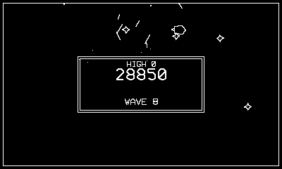

# Border Circuit

A frictionless knife-fight around the track.

## Controls

- Crank — steer (the original cabinet used a spinner)
- B or Up — thrust
- A — fire (max 4 shots)

## How it plays

No drag, and everything bounces — you, your shots, off the outer
walls and the central barrier that houses the scoreboard. Drone ships
lap the circuit and accelerate (200/250); mine-layers seed the track
with mines that arm after a second (350 shot; the layer is worth 500
if you kill it before it finishes its lap, 200 after). Mines persist
into the next wave. Extra ship at 40,000.

---

Part of [Phosphor](../../README.md) — `make bordercircuit` from the repo root
builds it; a ready-to-play copy ships in [`dist/`](../../dist/).
