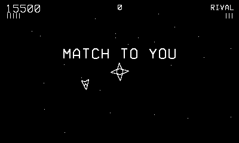

# Duelstar

Two ships, one sun, first to five.

## Controls

- Crank — turn
- B or Up — thrust
- A — fire (max 3, and gravity bends them)
- Down — hyperspace (1-in-6 doom)

## How it plays

You and the Rival, dueling around a sun that pulls on ships and
shots alike. Three hits ends a round — each one visibly knocks a
piece off the ship, and a one-hit-left ship flies worse. Rounds go to
five; the Rival rotates personalities (orbiter, sniper, brawler) and
sharpens as you win. 500 per hit, 2,000 per round, 10,000 for the
match. Sun contact settles arguments instantly.

---

Part of [Phosphor](../../README.md) — `make duelstar` from the repo root
builds it; a ready-to-play copy ships in [`dist/`](../../dist/).
