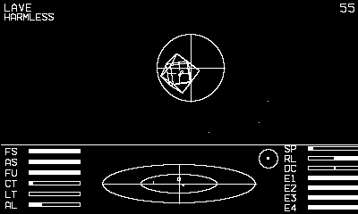

# Elite

Wireframe space trading and combat from the cockpit — fly, fight,
trade, and work your way across the galaxy.

## Controls

- Crank — roll (d-pad left/right rolls too)
- D-pad up/down — pitch (up climbs)
- A — fire the front laser
- B is the secondary-functions modifier:
  - B + up/down — throttle
  - B + A — launch a missile at the locked target
  - B + left — E.C.M. (destroy incoming missiles)
  - B + right — energy bomb
- Dock with the station for the trade screens — buy/sell cargo at the
  market, equip your ship, pick a jump target on the galactic chart

## How it plays

You are the ship: the cockpit is fixed and the whole universe wheels
around you as you roll and pitch, exactly as the 1984 original flew it.
Pirates close in and fire when they line you up — roll them onto the
vertical and pitch them into the reticle, and a held laser does the
rest. Watch the laser-temperature gauge (LT); a maxed laser cuts out
until it cools. Carry missiles for a locked kill, an E.C.M. to swat
incoming ones, and an energy bomb for when you're swarmed.

The 3D scanner below the view plots every contact: left/right and
fore/aft on the ellipse, above/below on the stalk; the compass points
to the station. Dock by flying slow and centred into the rotating
Coriolis slot — roll to line your ship up with it, or hit it wrong and
scatter yourself across the hull (a docking computer flies you in once
you can afford one).

Docked, the station screens are the other half of the game: buy low and
sell high across the 17 commodities, whose prices swing with each
system's economy; equip missiles, shields, scoops, an E.C.M., bigger
cargo holds; and pick your next jump from the **galactic chart**. The
galaxy is the real one — eight galaxies of 256 systems each, every name,
economy, government and tech level generated from Elite's own seed, so
Lave, Diso and Riedquat are right where they should be. Fuel limits each
jump; refuel at a station or skim a sun with scoops fitted.

Shoot the innocent and the police turn on you and your record slides
from Clean to Fugitive. Earn enough kills and the Navy sends you after
the Constrictor. Your commander — credits, cargo, kit, galaxy — is saved
at every dock, so a death drops you back at your last station. Kills
raise your combat rating from Harmless all the way to Elite.

The ships are the real thing: the meshes are the vertex-and-edge
blueprints from the [Elite source archive][src] (32 of them, from the
Sidewinder to the Coriolis station), the galaxy and economy are ported
from [Elite — The New Kind][nk], and the controls follow the NES port.

[src]: https://github.com/markmoxon/elite-source-code-library
[nk]: https://github.com/fesh0r/newkind

---

Part of [Phosphor](../../README.md) — `make elite` from the repo root
builds it; a ready-to-play copy ships in [`dist/`](../../dist/).
