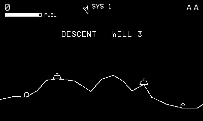

# Gravity Wells

Raid the wells. Mind the star.

## Controls

- Crank — rotate
- B or Up — thrust
- A — fire
- Down — tractor beam

## How it plays

Two scales: in the system view the central star pulls constantly and
touching it is final — fly into a planet to descend. Each well is a
side-view mission under gravity: beam up fuel tanks (your only
refills — thrust burns fuel everywhere), silence the bunkers (250),
and if you find the reactor, shoot it and get out within eight
seconds for a heavy bonus. Clear all four wells and the next system
pulls harder. Three ships; extra at 10,000.

---

Part of [Phosphor](../../README.md) — `make gravitywells` from the repo root
builds it; a ready-to-play copy ships in [`dist/`](../../dist/).
