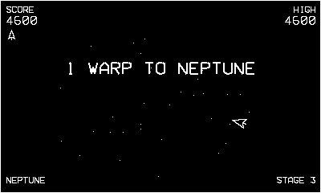

# Gyre

Vector orbit gunnery — an original implementation of the 1983 arcade
tube-shooter's design (the one that flew you from Neptune to Earth to
Bach). Your ship rides the rim of the screen; everything else pours out
of the deep.

## Controls

- **Crank** — fly the ship around the rim (one revolution = one full orbit)
- **A or B** — fire (hold for autofire)
- **D-pad left/right** — fly without the crank

## Rules

- Squadrons of drones swoop out of the center in looping chains, then
  settle into the rotating hub formation. From there they take turns
  diving at your orbit, shooting as they come. Divers are worth double.
- Clear the whole field to warp. Every third warp reaches a planet —
  Neptune, Uranus, Saturn, Jupiter, Mars, Earth, then around again,
  faster and meaner.
- **Satellites**: a trio slips in mid-stage and hangs just off the rim.
  Destroy all three (500/1000/1500) for **twin cannons**, kept until you
  lose a ship.
- **Meteors** (stage 2+): indestructible rocks tumbling outward. Your
  shots pass straight through — move.
- **Laser pairs** (stage 4+): two linked ships straddle the rim and drag
  a beam between them, sweeping after you. Shoot either ship to cut it.
- **Chance stages** at every planet: four squads of eight fly patterns
  and never shoot back. 100 a hit, 1500 for a perfect squad, 5000 for a
  perfect stage.
- Extra ship every 60,000. Dawdle too long and the formation flies off
  without you — no points for cowards' stalemates.

## Build

From the repo root: `make gyre` → `out/Gyre.pdx`, or grab the prebuilt
copy in [`dist/`](../../dist/).
