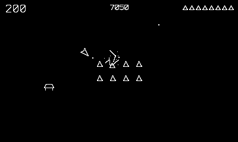

# Lifters

They're not here for you. They're here for the fuel.

## Controls

- Crank — spin the ship
- B or Up — thrust
- A — fire

## How it plays

Eight fuel canisters sit mid-field. Raiders fly in, latch on, and
drag them off-screen — kill the carrier and the can drops where it
was. You have unlimited ships; the game only ends when every canister
is gone. Raider types escalate from grabbers to gunners to rammers
(100/150/200). Survive as many raids as you can.

---

Part of [Phosphor](../../README.md) — `make lifters` from the repo root
builds it; a ready-to-play copy ships in [`dist/`](../../dist/).
