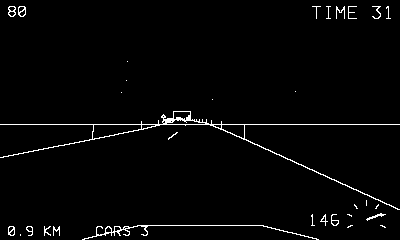

# Night Vector

Headlights, wireframes, and a closing clock.

## Controls

- Crank — steering wheel
- A — accelerate
- B — brake

## How it plays

Reach each kilometer checkpoint before the clock (+18 seconds per
checkpoint, tightening as you go). The road winds and rises; leaving
it scrubs speed violently, and the trees, signs, and traffic are less
forgiving (three cars per run). Overtakes pay 200; distance pays 10
per 100 m. Top speed 180 — use all of it.

---

Part of [Phosphor](../../README.md) — `make nightvector` from the repo root
builds it; a ready-to-play copy ships in [`dist/`](../../dist/).
