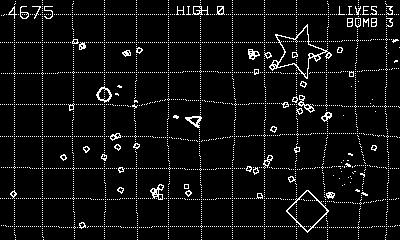

# Geometry Wars

Twin-stick arena shooting on a living vector grid.

## Controls

- D-pad — fly the ship (full momentum, eight directions)
- Crank — absolute aim dial: point it where the guns should fire
- Autofire is always on
- B (or A) — smart bomb

## How it plays

Survive an arena that fills with geometric enemies. Twin guns fire wherever
the crank points, so flying and aiming are independent — circle a swarm while
raking it from the side. Every kill drops a **geom**; sweep them up to climb
your scoring **multiplier** (every kill is worth more), but die and the
multiplier resets to one.

The cast arrives as the run heats up:

- **Grunts** — diamonds that home straight in (50)
- **Wanderers** — drifters that bounce off the walls (25)
- **Spinners** — stars that charge you and split into two tiny spinners (100 + 50×2)
- **Weavers** — hexagons that juke your shots (100)
- **Black holes** — drag the grid into a deep well and pull in everything
  nearby; pump enough rounds in and they burst into a ring of **protons** (75)

The whole floor is a spring-loaded lattice: your wake, your shots, every
explosion, the bombs, and the black holes dent and ripple it. Three lives,
three bombs, an extra ship every 75,000. A smart bomb clears the screen and
blows the grid wide open — save them.

---

Part of [Phosphor](../../README.md) — `make opengw` from the repo root
builds it; a ready-to-play copy ships in [`dist/`](../../dist/). An original
implementation of the [Open Geometry Wars][gw] design; clone the upstream C++
source into `opengw/` (git-ignored) as a reference.

[gw]: https://github.com/capehill/opengw
