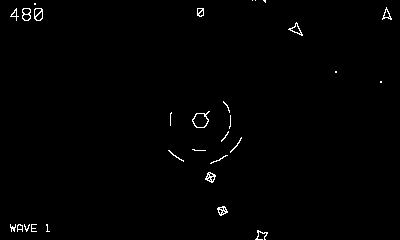

# Ringkeep

Crack the fortress before it cracks you.

## Controls

- Crank — spin the ship
- B or Up — thrust
- A — fire

## How it plays

Three shield rings counter-rotate around the cannon core: twelve
segments each, one segment per hit (10 points), outer rings first.
When the core sees you through aligned gaps it breathes a homing
fireball — outrun it, it tires after a few seconds. Two mines patrol
the rings and peel off to chase (100). Kill the exposed core for
1,500 and an extra ship — the rings regrow, faster.

---

Part of [Phosphor](../../README.md) — `make ringkeep` from the repo root
builds it; a ready-to-play copy ships in [`dist/`](../../dist/).
