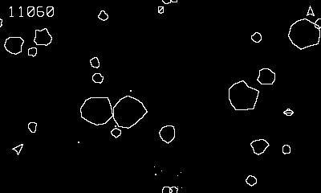

# Rubble

Vector rock-blasting with full momentum.

## Controls

- Crank — spin the ship 1:1
- B or Up — thrust
- A — fire (max 4 shots)
- Down — hyperspace (1-in-6 chance you never come back)

## How it plays

Clear the field. Large rocks split into two mediums, mediums into two
smalls (20 / 50 / 100 points). Saucers visit: the big one fires blind
(200), the small one aims — and its aim tightens as your score grows
(1000). Each cleared field spawns a bigger one, and the background
heartbeat quickens as the rocks thin out. Extra ship every 10,000.

---

Part of [Phosphor](../../README.md) — `make rubble` from the repo root
builds it; a ready-to-play copy ships in [`dist/`](../../dist/).
