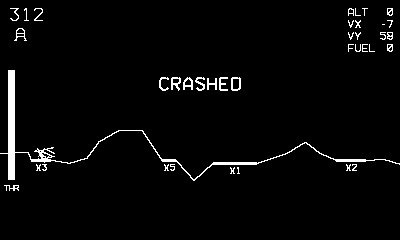

# Touchdown

Bring the lander down in one piece.

## Controls

- Crank — throttle (analog, 0–100%)
- Left/Right — tilt
- B — full burn

## How it plays

Gravity is patient; your fuel is not. Land on a flat pad with
|vx| < 12, vy < 25 and under 12° of tilt. Narrow pads pay a higher
multiplier (shown beside each pad) on the 50-point base plus a fuel
bonus. Each landing banks +25% fuel and deals a fresh moonscape.
Three landers; the game ends when landers or fuel run out.

---

Part of [Phosphor](../../README.md) — `make touchdown` from the repo root
builds it; a ready-to-play copy ships in [`dist/`](../../dist/).
