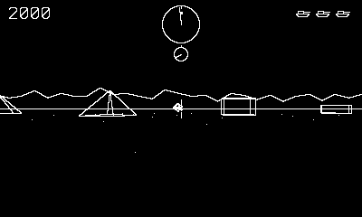

# Treadline

First-person tank duels on an endless plain.

## Controls

- D-pad — drive the treads (up/down move, left/right pivot)
- Crank — slew the turret independently of the hull
- A or B — fire (one shell in flight)

## How it plays

The radar reads relative to your turret, and the needle below it
shows how far your gun has wandered from your hull. Hostile tanks
stalk, circle, and lead their shots — their aim sharpens with every
kill of yours (1,000). Every third contact is a skimmer that just
rams (2,500). Pyramids and blocks stop shells — yours and theirs.
Three lives; extra at 15,000.

---

Part of [Phosphor](../../README.md) — `make treadline` from the repo root
builds it; a ready-to-play copy ships in [`dist/`](../../dist/).
