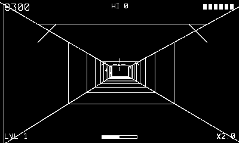

# Trenchfire

Fight through to the fortress, then thread the needle.

## Controls

- D-pad — crosshair (the ship chases it)
- Crank — throttle (faster = higher score multiplier, harder dodging)
- A or B — fire

## How it plays

Each level runs three phases: fighters swooping in from the deep
(200), turret towers on the ground grid (250), then the trench —
hardpoints on the walls (150), braces overhead, and a port window at
the end. Put a shot through the port to bring the fortress down:
5,000 times your throttle multiplier, plus a shield. Shields are your
lives (start with 6); enemy fire and wall scrapes cost one. Fireballs
can be shot down (50).

---

Part of [Phosphor](../../README.md) — `make trenchfire` from the repo root
builds it; a ready-to-play copy ships in [`dist/`](../../dist/).
