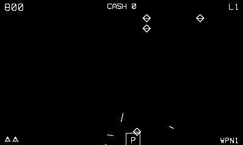

# Vectorblade

A vector swarm shooter — Galaga by way of Warblade.

## Controls

- Crank — slide the fighter along the bottom (the cabinet spinner)
- Left / Right — d-pad fallback
- A — fire (autofire once you find or buy it)
- B — smart bomb (when you own one)

## How it plays

Hold the bottom of the field while waves stream in along curved paths and
lock into a breathing formation overhead. Fighters peel off to dive and
fire — dodge them, shoot up, and clear the wave. Drones, wedges, tie
swarmers, and birds are worth 100 / 150 / 250 / 400; a boss arrives every
fifth level and takes a beating before it bursts (25,000).

Kills drop labelled power-ups that drift down — catch them with the
fighter:

- **C** cash · **P** wider gun · **R** faster shots · **X** double score
- **S** shield · **A** armour plate · **F** autofire · **1** extra life

Between every wave the **shop** opens: spend banked cash on speed, bullets,
rate, shields, armour, autofire, bombs, and lives (Up/Down or crank to
choose, A to buy, B to fly on). A death costs you a weapon stage, so the
shop is how you climb back. Extra life every 20,000, and your final score
earns a naval rank from Ensign up to Great Defender.

---

Part of [Phosphor](../../README.md). An original implementation built on the
shared cabinet, after Malban's public-domain Vectrex *Vectorblade*. `make
vectorblade` from the repo root builds it; a ready-to-play copy ships in
[`dist/`](../../dist/).
