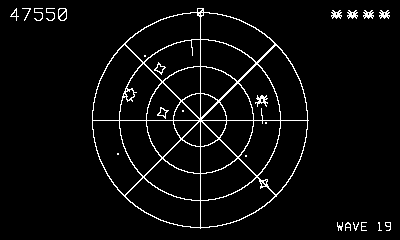

# Webguard

Twin-stick defense, Playdate style.

## Controls

- D-pad — move the spider
- Crank — aim
- Hold A or B — autofire

## How it plays

Your web, your rules. Chasers crawl in along the spokes (150);
layers wander the strands depositing eggs at the intersections — eggs
are 50 now or a fresh chaser in six seconds; bombers drift across and
burst into four fragments (300). Touching anything costs a life.
Extra life at 20,000, and the waves keep thickening.

---

Part of [Phosphor](../../README.md) — `make webguard` from the repo root
builds it; a ready-to-play copy ships in [`dist/`](../../dist/).
