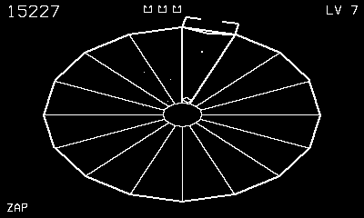

# Welldiver

A tube shooter staring down the well.

## Controls

- Crank — spin the claw around the rim
- B — fire
- A — superzapper (full clear once per level; one kill the second time)
- Left/Right or crank on the title — choose starting level 1/3/5/7

## How it plays

Enemies climb the well: flippers cartwheel lane to lane and stalk you
along the rim; tankers split when shot; spikers leave spikes in the
lanes; pulsars electrify theirs on a pulse. Clear the wave, then fly
down the well — steer to a spike-free lane or shoot yours clear.
Deeper starting levels pay a bonus, and every level draws the well in
its own line style.

---

Part of [Phosphor](../../README.md) — `make welldiver` from the repo root
builds it; a ready-to-play copy ships in [`dist/`](../../dist/).
